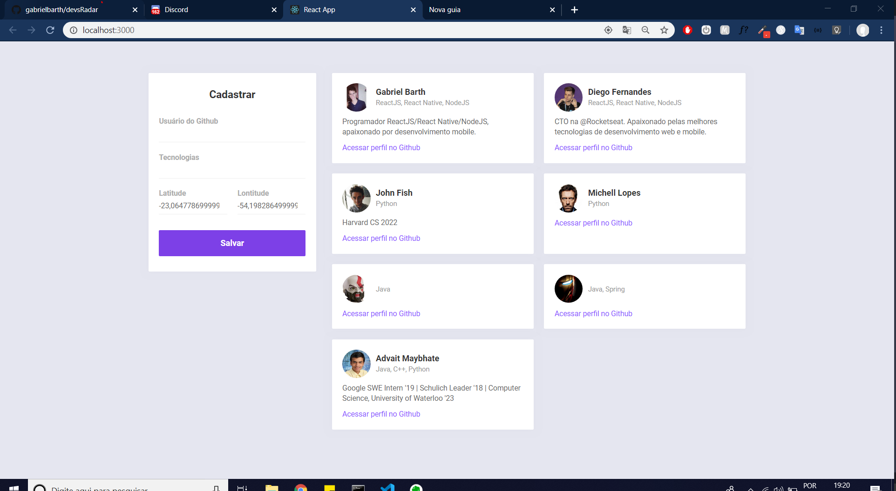
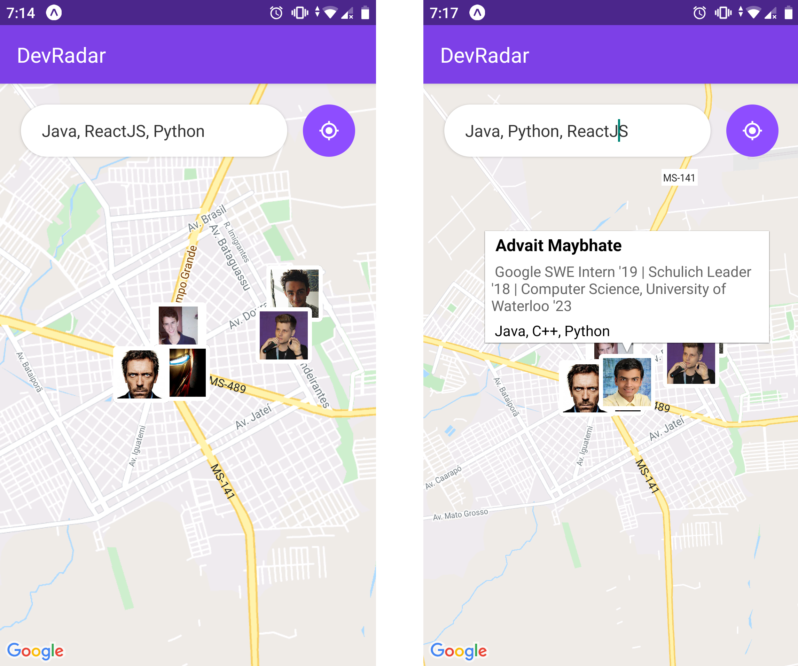

# devRadar


```diff
# português-br
```

Projeto desenvolvido durante a semana Omnistack 10 da Rocketseat. Trata-se de uma plataforma fullstack desenvolvida utilizando ReactJS, React native e Node.js.

O objetivo da aplicação é permitir que desenvolvedores descubram colegas ao seu redor e, especialmente, as linguagens de programação com as quais estes trabalham.

Para o projeto também foi implementado WebSocket, permitindo a atualização/comunicação em real time entre as plataformas.

Veja o funcionamento: https://www.youtube.com/watch?v=QbBkCYPoCtw&feature=youtu.be
```diff
# english
```

Fullstack application to enable dev meeting others programmers and his tecnologies. It was developed using React, React Native and Node.js.

The project was developed by RocketSeat during the Omnistack Week 10.

See the app working on: https://www.youtube.com/watch?v=QbBkCYPoCtw&feature=youtu.be




```diff
# Como executar este projeto?
```

Clone o projeto: git clone https://github.com/gabrielbarth/devRadar.git

```diff
# backend
```

Entre no diretório backend e instale as dependências do package.json: yarn install  ou  npm install

Crie uma conta no <a href="https://www.mongodb.com/cloud/atlas">mongoDB atlas </a> 

Construa um novo Cluster (local onde será armazenado seus bancos de dados): "Build a New Cluster";

Clique em CONNECT e escolha a opção "Connect Your Application"; depois copie a string de conexão e substitua a string de conexão que está dentro da função mongoose.connect - do arquivo index.js.

Não se esqueça de executar o servidor para realizar testes, neste caso com o seguinte comando: yarn dev;

Para observar os dados cadastrados no Banco, você também pode realizar conexão via  <a href="https://docs.mongodb.com/compass/master/connect/"> mongoDB Compass </a>


```diff
# web
```
Entre no diretório web e instale as dependências do package.json: yarn install  ou  npm install

Para executar/testar, execute: yarn start  ou  npm start


```diff
# mobile
```
Entre no diretório mobile e instale as dependências do package.json: yarn install  ou  npm install

baixe o app do expo no seu dispositivo móvel

no arquivo api.js (dentro da pasta services), coloque seu IP local na baseURL para conseguir executar o aplicativo
Caso você tenha iPhone, seu IP será "http://localhost:3333"

dentro do diretório mobile, execute o comando: expo start

Com o app do expo, escaneie o QRcode que aparecerá na sua tela

Entenda mais sobre expo <a href="https://expo.io/learn"> AQUI</a> 

#### Caso tenha dúvidas (ou observou que esqueci de algum passo, rrsrs), entre em contato comigo!
