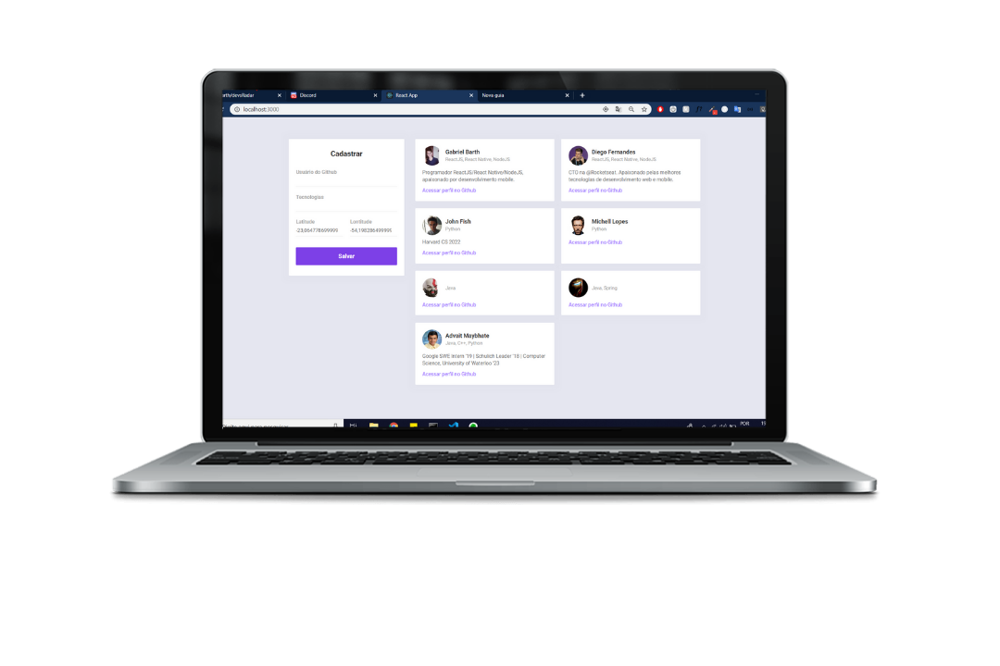
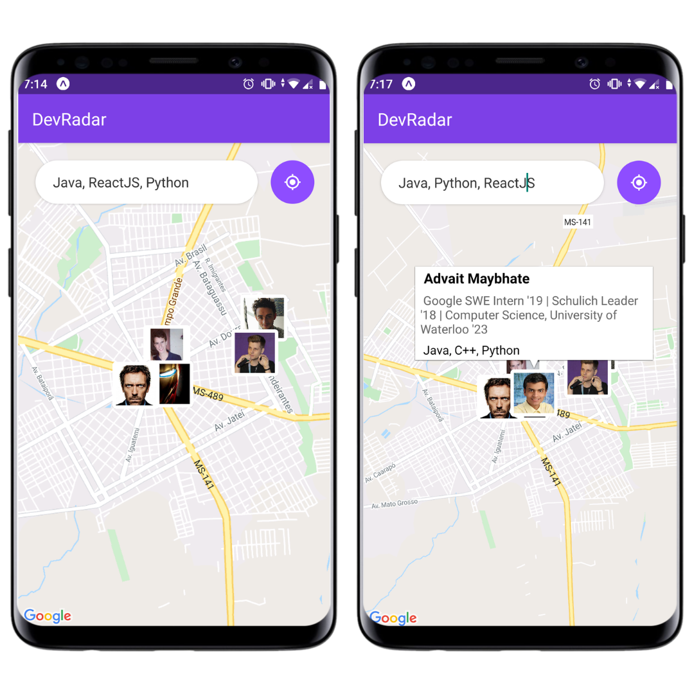

<h1 align="center">
  DevRadar :round_pushpin: :octocat:
</h1>

Fullstack application to allow dev meeting others programmers and his tecnologies. 
It was developed using **React**, **React Native** and **Node.js**, during RocketSeat Omnistack v10 week.

See the app working on: https://www.youtube.com/watch?v=QbBkCYPoCtw&feature=youtu.be

 
  
  

## :computer: Getting Started - Running on your machine

These instructions will get you a copy of the project up and running on your local machine for development and testing purposes.

First of all, clone this project using the following command: `git clone https://github.com/gabrielbarth/devRadar.git`

### Backend :floppy_disk:

#### :ballot_box_with_check: Prerequisites
Follow the bellow steps to run backend project on your machine:

**1.** Create an account in <a href="https://www.mongodb.com/cloud/atlas">mongoDB atlas </a> 

**2.** Build a new Cluster - location where your databases will be stored

**3.** Click on **CONNECT** and choose the option "Connect Your Application"; then copy the connection string and replace the connection string that is inside the **mongoose.connect function** - in **index.js file**.

**4.** To check if data is being registered on database you need open 
<a href="https://docs.mongodb.com/compass/master/connect/">mongoDB Compass</a>

#### :hammer_and_wrench: Installing

**1.** Enter in backend directory: `cd backend` and install packege.json dependencies: `yarn` or `npm install`

**1.** Run `yarn start` or `npm start` to initialize backend server

### Web project :computer:
#### :hammer_and_wrench: Installing

**1.** Make sure that backend is running on port 3333;

**2.** Enter in the appropriated directory: `cd web` and install packege.json dependencies: `yarn` or `npm install`

**3.** Run on your browser using the following command: `yarn start` or `npm start`

### Mobile project :iphone: 
#### :hammer_and_wrench: Installing

**1.** Make sure that backend is running on port 3333;

**2.** Enter in the appropriated directory: `cd web` and install packege.json dependencies: `yarn` or `npm install`

**3.** Download expo application on play store or apple store and install it on your phone

**4.** Set your local IP address on services/**api.js file**. Use `http://localhost:3333` if you have an iPhone.

**5.** Run `expo start` to run the application

**6.** Enter expo application and scan QR Code that will appear on your browser.

Read more about expo <a href="https://expo.io/learn">HERE</a>.

## :bulb: :handshake: Contributing
Please feel free to contributing and submitting pull requests.

## :pray: Acknowledgments
* Rocketseat team

## :thinking: Any question?
**Contact me on my social medias:** 
[LinkedIn](https://www.linkedin.com/in/gabriel-barth-silv%C3%A9rio-6081ba153/)  
[Instagram](https://instragram.com/gb1.dev)  
[YouTube](https://www.youtube.com/channel/UCmA_19d5L3WTFdDfwQ6Uenw)  
[Discord](https://www.wikihow.com/Add-Friends-on-Discord) (**gabrielbarth1#0492**) 
Or send me an email :incoming_envelope:: gabrielbarth.dev@gmail.com.
 
 

  Made with ♥ by <a href="https://gabrielbarth.com/">Gabriel Barth</a>

